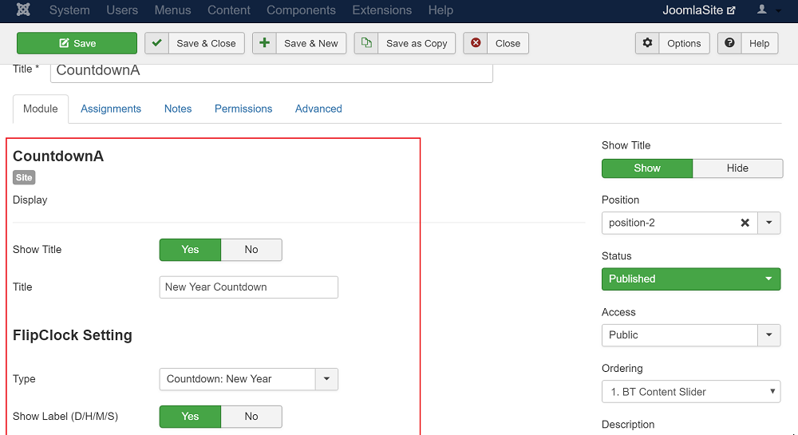

# Intro
Joomla module of [FlipClock JS](http://flipclockjs.com/).

**Front End**

**Back End**

# Installation
1. git clone
2. Zip cloned folder
3. Install in joomla admin -> Extensions -> Manage -> Install

# Usage
Extensions -> Modules -> CountdownA
